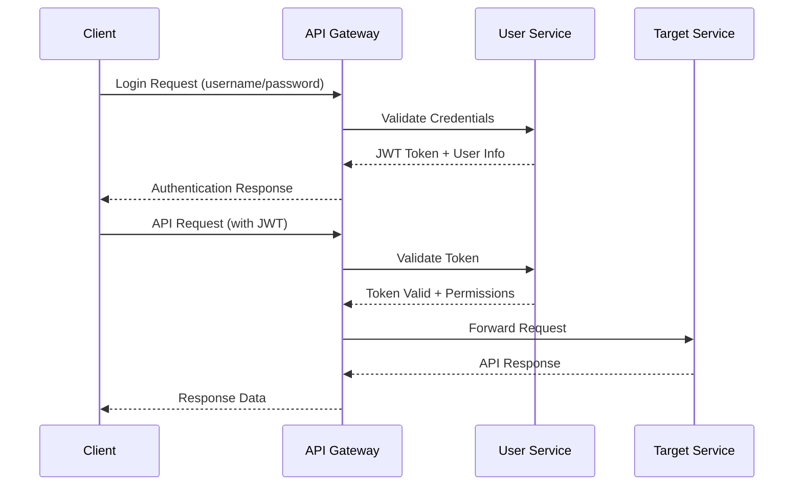

# API Definitions and Documentation

## Overview
This document provides API documentation for the QA Healthcare system. Currently, the system is in development phase with basic infrastructure and mock data implementation.

## Current Project State

### System Architecture
- **Frontend**: Vue 3 + TypeScript + Ant Design Vue (Port: 5173)
- **Backend Services**:
  - `qa-service-user`: User management service (Port: 8080)
  - `qa-service-question`: Question management service (Framework only, no implementation yet)
- **Data Storage**: Local mock data (JSON files) in frontend

### Development Status
- ✅ Frontend application with mock data
- ✅ Basic user service with CORS configuration
- ⏳ Question service (framework only)
- ❌ Authentication system (planned)
- ❌ Database integration (planned)
- ❌ Real API integration (planned)

## Available APIs

### User Service (qa-service-user)

**Service Information:**
- Port: 8080
- Base URL: http://localhost:8080
- Status: Basic CORS testing endpoints available

#### Test Endpoints

##### Test CORS Configuration (GET)
```http
GET /api/test/cors
```

**Response:**
```json
{
  "message": "CORS configuration is working!",
  "timestamp": 1699000000000,
  "service": "qa-service-user"
}
```

##### Test CORS Configuration (POST)
```http
POST /api/test/cors
Content-Type: application/json

{
  "testData": "example",
  "userId": 123,
  "action": "test"
}
```

**Response:**
```json
{
  "message": "POST request with CORS is working!",
  "receivedData": {
    "testData": "example",
    "userId": 123,
    "action": "test"
  },
  "timestamp": 1699000000000,
  "service": "qa-service-user"
}
```

#### Spring Boot Actuator Endpoints

| Method | Endpoint | Description |
|--------|----------|-------------|
| GET | `/actuator/health` | Application health check |
| GET | `/actuator/info` | Application information |
| GET | `/actuator/metrics` | Application metrics |
| GET | `/actuator/env` | Environment information |
| GET | `/actuator/beans` | Spring Bean information |
| GET | `/actuator/loggers` | Loggers configuration |

**Health Check Response:**
```json
{
  "status": "UP",
  "components": {
    "diskSpace": {
      "status": "UP",
      "details": {
        "total": 499963174912,
        "free": 123456789012,
        "threshold": 10485760,
        "exists": true
      }
    },
    "ping": {
      "status": "UP"
    }
  }
}
```

### Question Service (qa-service-question)

**Service Information:**
- Port: (Not configured yet)
- Status: Framework only - no API endpoints implemented
- Dependencies: Spring Boot 3.5.7, Spring Web

## Frontend Mock Data Structure

### Doctors Data (`/web/qa-web/src/data/doctor-user-list.json`)
```json
[
  {
    "id": "doc001",
    "username": "dr-zhang-wei",
    "password": "123456",
    "name": "张伟医生",
    "title": "主任医师",
    "department": "心内科",
    "avatar": "https://images.pexels.com/photos/5215024/pexels-photo-5215024.jpeg",
    "experience": "15年临床经验",
    "specialties": ["高血压", "冠心病", "心律失常"],
    "isActive": true
  }
]
```

### Patients Data (`/web/qa-web/src/data/patient-user.json`)
```json
[
  {
    "id": "patient001",
    "name": "张明",
    "birthday": "1985-03-15",
    "phone": "13800138000",
    "gender": "男"
  }
]
```

### Questions Data (`/web/qa-web/src/data/question-list.json`)
```json
[
  {
    "id": "q001",
    "patientId": "patient001",
    "patientName": "张明",
    "doctorId": "doc001",
    "doctorName": "张伟医生",
    "question": "最近总是感觉胸闷气短,特别是爬楼梯的时候,这是什么原因?需要做哪些检查?",
    "submitTime": "2025-11-02T09:30:00Z",
    "status": "answered",
    "answer": "根据您的描述,可能是心脏功能问题。建议您做个心电图和心脏彩超检查...",
    "answerTime": "2025-11-02T09:45:00Z"
  }
]
```

## Frontend Store API (Mock Implementation)

The frontend uses a reactive store with the following methods:

### Doctor Management
```typescript
// Login doctor
store.loginDoctor(username: string, password: string): Doctor | null

// Get doctor by username
store.getDoctorByUsername(username: string): Doctor | undefined

// Get active doctors
store.getActiveDoctors(): Doctor[]

// Logout doctor
store.logoutDoctor(): void
```

### Patient Management
```typescript
// Verify/Create patient
store.verifyPatient(name: string, birthday: string): Patient

// Logout patient
store.logoutPatient(): void
```

### Question Management
```typescript
// Add new question
store.addQuestion(question: Omit<Question, 'id' | 'submitTime' | 'status' | 'answer' | 'answerTime'>): Question

// Answer question
store.answerQuestion(questionId: string, answer: string): void

// Get questions by doctor
store.getQuestionsByDoctor(doctorId: string): Question[]

// Get questions by patient
store.getQuestionsByPatient(patientId: string): Question[]
```

### Statistics
```typescript
// Get system statistics
store.getStatistics(): {
  totalDoctors: number;
  totalQuestions: number;
  activeSessions: number;
  totalSessions: number;
}
```

## Planned API Architecture

### Future API Gateway Configuration (Planned)
```yaml
# Planned API Gateway Routing Configuration
routes:
  # User Service APIs
  - path: /api/users/**
    service: qa-service-user
    methods: [GET, POST, PUT, DELETE]
    authentication: required
  
  # Question Service APIs  
  - path: /api/questions/**
    service: qa-service-question
    methods: [GET, POST, PUT, DELETE]
    authentication: required
  
  # Authentication APIs
  - path: /api/auth/**
    service: qa-service-user
    methods: [POST]
    authentication: optional
  
  # Public Health Check
  - path: /health
    service: all-services
    methods: [GET]
    authentication: none
```

### Planned API Versioning Strategy
```
/api/v1/...      # Planned stable version
```

## Planned Authentication and Authorization

### Planned JWT Authentication Flow


### Planned Authentication API

#### Login (Planned)
```http
POST /api/auth/login
Content-Type: application/json

{
  "username": "dr-zhang-wei",
  "password": "123456",
  "userType": "doctor"  # "patient", "doctor"
}
```

**Planned Response:**
```json
{
  "success": true,
  "data": {
    "token": "eyJhbGciOiJIUzI1NiIsInR5cCI6IkpXVCJ9...",
    "expiresIn": 86400,
    "user": {
      "id": "doc001",
      "username": "dr-zhang-wei",
      "name": "张伟医生",
      "userType": "doctor",
      "department": "心内科",
      "title": "主任医师"
    }
  }
}
```

## Planned User Service APIs

### User Management (Planned)

#### Get Current User Profile (Planned)
```http
GET /api/v1/users/me
Authorization: Bearer {token}
```

**Planned Response:**
```json
{
  "id": "doc001",
  "username": "dr-zhang-wei",
  "name": "张伟医生",
  "userType": "doctor",
  "department": "心内科",
  "title": "主任医师",
  "avatar": "https://images.pexels.com/photos/5215024/pexels-photo-5215024.jpeg",
  "experience": "15年临床经验",
  "specialties": ["高血压", "冠心病", "心律失常"],
  "isActive": true
}
```

#### List Doctors (Planned)
```http
GET /api/v1/users/doctors
Authorization: Bearer {token}
Query Parameters:
  - department: 科室筛选 (optional)
  - isActive: 是否在线 (optional)
```

**Planned Response:**
```json
{
  "success": true,
  "data": {
    "doctors": [
      {
        "id": "doc001",
        "name": "张伟医生",
        "department": "心内科",
        "title": "主任医师",
        "avatar": "https://images.pexels.com/photos/5215024/pexels-photo-5215024.jpeg",
        "experience": "15年临床经验",
        "specialties": ["高血压", "冠心病", "心律失常"],
        "isActive": true
      }
    ]
  }
}
```

## Planned Question Service APIs

### Question Management (Planned)

#### Ask a Question (Planned)
```http
POST /api/v1/questions
Authorization: Bearer {token}
Content-Type: application/json

{
  "patientId": "patient001",
  "doctorId": "doc001",
  "question": "最近总是感觉胸闷气短,特别是爬楼梯的时候,这是什么原因?需要做哪些检查?"
}
```

**Planned Response:**
```json
{
  "success": true,
  "data": {
    "id": "q001",
    "patientId": "patient001",
    "doctorId": "doc001",
    "question": "最近总是感觉胸闷气短,特别是爬楼梯的时候,这是什么原因?需要做哪些检查?",
    "status": "pending",
    "submitTime": "2025-11-02T09:30:00Z"
  }
}
```

#### Get Question Details (Planned)
```http
GET /api/v1/questions/{questionId}
Authorization: Bearer {token}
```

**Planned Response:**
```json
{
  "success": true,
  "data": {
    "id": "q001",
    "patientId": "patient001",
    "patientName": "张明",
    "doctorId": "doc001",
    "doctorName": "张伟医生",
    "question": "最近总是感觉胸闷气短,特别是爬楼梯的时候,这是什么原因?需要做哪些检查?",
    "status": "answered",
    "submitTime": "2025-11-02T09:30:00Z",
    "answer": "根据您的描述,可能是心脏功能问题。建议您做个心电图和心脏彩超检查...",
    "answerTime": "2025-11-02T09:45:00Z"
  }
}
```

#### Answer Question (Planned)
```http
POST /api/v1/questions/{questionId}/answer
Authorization: Bearer {token}
Content-Type: application/json

{
  "answer": "根据您的描述,可能是心脏功能问题。建议您做个心电图和心脏彩超检查..."
}
```

## Error Handling

### Current Error Response Format (Spring Boot Default)
```json
{
  "timestamp": "2025-11-03T10:15:30.000+00:00",
  "status": 400,
  "error": "Bad Request",
  "message": "详细错误信息",
  "path": "/api/test/cors"
}
```

### Planned Standard Error Response Format
```json
{
  "success": false,
  "error": {
    "code": "VALIDATION_ERROR",
    "message": "请求数据验证失败",
    "details": [
      {
        "field": "username",
        "message": "用户名不能为空"
      }
    ],
    "timestamp": "2025-11-02T10:15:30.000Z"
  }
}
```

### Common Error Codes (Planned)

| HTTP Status | Error Code | Description | Resolution |
|-------------|------------|-------------|------------|
| 400 | `VALIDATION_ERROR` | 请求数据验证失败 | 检查请求数据格式 |
| 401 | `UNAUTHORIZED` | 未授权访问 | 提供有效的认证令牌 |
| 403 | `FORBIDDEN` | 权限不足 | 检查用户角色和权限 |
| 404 | `RESOURCE_NOT_FOUND` | 资源不存在 | 检查资源ID是否正确 |
| 409 | `RESOURCE_CONFLICT` | 资源冲突 | 使用不同的标识符 |
| 500 | `INTERNAL_SERVER_ERROR` | 服务器内部错误 | 联系技术支持 |

## Testing and Development

### Current Test Endpoints

#### CORS Test
```http
GET http://localhost:8080/api/test/cors
```

#### Health Check
```http
GET http://localhost:8080/actuator/health
```

### Development Commands

#### Start User Service
```bash
cd /home/azureuser/source/tkt01/qa-live-healthcare-bolt-vue-c1joxy7j/server/qa-service-user
./mvnw spring-boot:run
```

#### Start Frontend Application
```bash
cd /home/azureuser/source/tkt01/qa-live-healthcare-bolt-vue-c1joxy7j/web/qa-web
npm run dev
```

## API Documentation Tools

### Current Documentation
- **User Service API Docs**: `/server/qa-service-user/docs/api.md`
- **Project Structure**: `/web/qa-web/docs/project-structure.md`

### Planned OpenAPI/Swagger Specification
```yaml
openapi: 3.0.0
info:
  title: QA Healthcare API
  description: 医疗问答系统API文档
  version: 1.0.0

servers:
  - url: http://localhost:8080
    description: Local development

paths:
  /api/test/cors:
    get:
      summary: Test CORS configuration
      description: 测试CORS配置
      responses:
        '200':
          description: Successful response
          content:
            application/json:
              schema:
                type: object
                properties:
                  message:
                    type: string
                  timestamp:
                    type: integer
                  service:
                    type: string
```

## Development Roadmap

### Phase 1: Current State (Completed)
- ✅ Basic frontend with Vue 3 + TypeScript
- ✅ Mock data implementation
- ✅ User service framework with CORS
- ✅ Question service framework

### Phase 2: API Implementation (Next Steps)
1. **Implement User Service APIs**:
   - User registration/login
   - Doctor/patient management
   - Authentication with JWT

2. **Implement Question Service APIs**:
   - Question submission
   - Answer management
   - Question status tracking

3. **Database Integration**:
   - PostgreSQL setup
   - Entity definitions
   - Repository layer

### Phase 3: System Integration
1. **Frontend-Backend Integration**:
   - Replace mock data with real API calls
   - Implement authentication flow
   - Error handling and loading states

2. **Additional Features**:
   - Real-time notifications
   - File upload for medical images
   - Prescription management

## Best Practices

### Current Implementation Practices
1. **Frontend**:
   - Vue 3 Composition API
   - TypeScript for type safety
   - Component-based architecture
   - Responsive design with Ant Design Vue

2. **Backend**:
   - Spring Boot microservices
   - RESTful API design
   - CORS configuration
   - Actuator for monitoring

### Planned Best Practices
1. **API Design**:
   - RESTful endpoints with proper HTTP methods
   - Consistent response formats
   - Versioning strategy
   - Comprehensive error handling

2. **Security**:
   - JWT authentication
   - Input validation
   - SQL injection prevention
   - CORS configuration

3. **Healthcare Compliance**:
   - Data encryption
   - Access control
   - Audit logging
   - Patient consent management

---

*This API documentation reflects the current state of the QA Healthcare project. As the project evolves, this document should be updated to reflect new APIs and changes. Use the context update tools to keep this documentation current.*