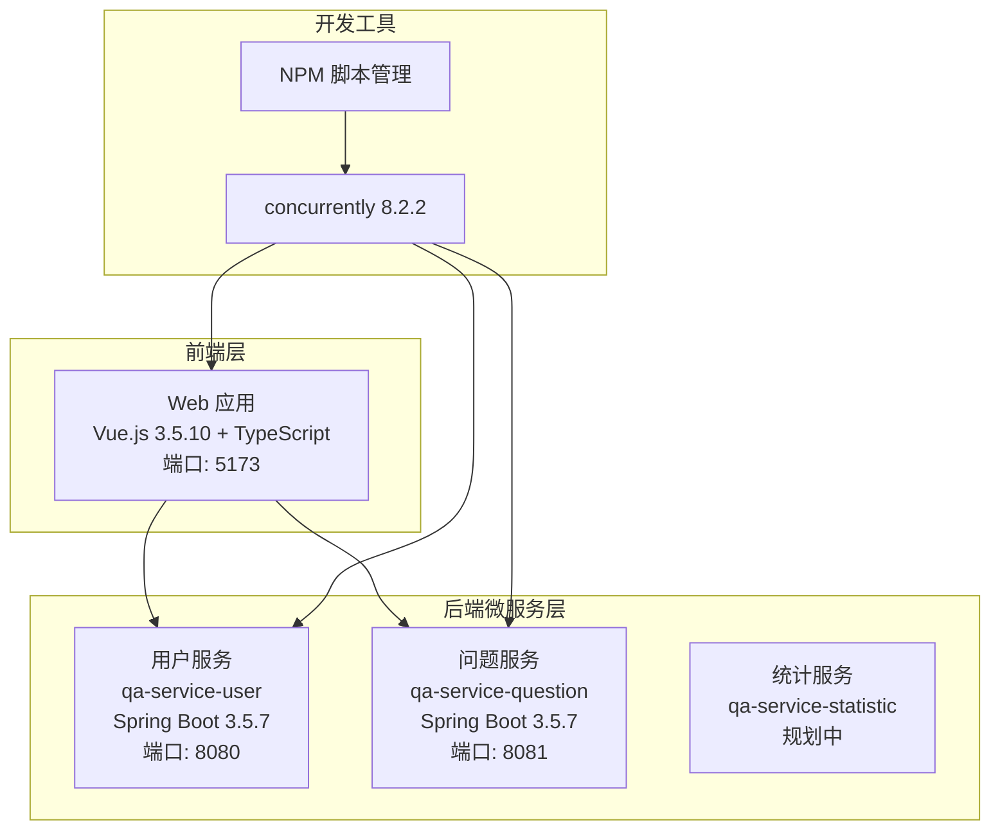

# QA Healthcare 项目架构文档

## 概述
本文档基于对项目实际代码的分析，描述了 QA Healthcare 医疗问答系统的真实架构状态。文档已更新以反映项目的当前实现情况，移除了不相关的内容。

## 系统架构

### 实际项目架构


## 技术栈（实际状态）

### 前端技术栈
- **框架**: Vue.js 3.5.10 (Composition API + TypeScript 5.5.3)
- **构建工具**: Vite 5.4.8 + vue-tsc 2.1.6
- **UI 组件库**: Ant Design Vue 4.2.6
- **路由**: Vue Router 4.6.3
- **工具库**: Day.js 1.11.19
- **状态管理**: 目前使用组件状态（未引入 Pinia/Vuex）

### 后端技术栈
- **框架**: Spring Boot 3.5.7 (Java 17 - OpenJDK Temurin)
- **构建工具**: Maven (通过 mvnw 包装器)
- **数据库**: 内存数据库（开发阶段）
- **监控**: Spring Boot Actuator（健康检查端点）

### 服务详情
1. **qa-service-user** (端口 8080)
   - 用户管理服务
   - 包含 CORS 配置
   - Actuator 健康检查端点
   - 测试 API: `/api/test/cors`

2. **qa-service-question** (端口 8081)
   - 问题管理服务
   - Testcontainers 测试支持
   - Actuator 健康检查端点

3. **qa-service-statistic** (规划中)
   - 仅包含 `.gitkeep` 文件
   - 功能待开发

### 开发工具
- **Node.js**: 22.18.0
- **npm**: 10.9.3
- **并发启动**: concurrently 8.2.2
- **版本控制**: Git

## 项目结构

### 前端结构 (`web/qa-web/`)
```
src/
├── api/              # API 接口模块
├── components/       # Vue 组件
│   ├── AppHeader.vue    # 页面头部
│   ├── AppFooter.vue    # 页面底部
│   └── HelloWorld.vue   # 示例组件
├── data/            # 静态数据文件
│   ├── doctor-user-list.json    # 医生用户列表
│   ├── patient-user.json        # 患者用户数据
│   └── question-list.json       # 问题列表
├── router/          # 路由配置
│   └── index.ts     # 路由定义
├── store/           # 状态管理（基础结构）
│   └── index.ts     # 状态管理入口
└── views/           # 页面视图
    ├── Home.vue              # 首页
    ├── Consultation.vue      # 咨询页面
    ├── DoctorLogin.vue       # 医生登录
    ├── DoctorRoom.vue        # 医生房间
    ├── Doctors.vue           # 医生列表
    └── About.vue             # 关于页面
```

### 后端结构 (`server/`)
```
qa-service-user/
├── src/main/java/com/leansofx/qaserviceuser/
│   ├── config/
│   │   └── CorsConfig.java          # CORS 跨域配置
│   ├── controller/
│   │   └── TestController.java      # 测试控制器
│   ├── dto/                         # 数据传输对象
│   ├── entity/                      # 实体类
│   ├── repository/                  # 数据访问层
│   └── service/                     # 业务逻辑层
├── docs/
│   ├── api.md                       # API 文档
│   └── project-structure.md         # 项目结构文档
└── pom.xml                         # Maven 配置

qa-service-question/
├── src/main/java/com/leansofx/qaservicequestion/
│   ├── config/                      # 配置类
│   └── controller/                  # 控制器
└── pom.xml                         # Maven 配置
```

## 路由设计

### 前端路由
```typescript
const routes = [
  { path: '/', name: 'Home', component: Home },
  { path: '/consultation', name: 'Consultation', component: Consultation },
  { path: '/consultation/:doctorUsername', name: 'ConsultationRoom', component: Consultation },
  { path: '/doctors', name: 'Doctors', component: Doctors },
  { path: '/about', name: 'About', component: About },
  { path: '/doctor/login', name: 'DoctorLogin', component: DoctorLogin },
  { path: '/doctor/room/:username', name: 'DoctorRoom', component: DoctorRoom }
];
```

### 后端 API 端点
**用户服务 (8080):**
- `GET /api/test/cors` - CORS 测试端点
- `POST /api/test/cors` - CORS POST 测试
- `GET /actuator/health` - 健康检查
- `GET /actuator/info` - 应用信息
- `GET /actuator/metrics` - 性能指标

**问题服务 (8081):**
- `GET /actuator/health` - 健康检查
- `GET /actuator/info` - 应用信息

## 开发环境

### 端口配置
| 服务 | 端口 | 访问地址 | 状态检查 |
|------|------|----------|----------|
| 前端开发服务器 | 5173 | http://localhost:5173 | 页面访问 |
| 用户管理服务 | 8080 | http://localhost:8080 | `/actuator/health` |
| 问题管理服务 | 8081 | http://localhost:8081 | `/actuator/health` |

### 启动命令
```bash
# 安装所有依赖
npm install
npm run install:all

# 启动所有服务（前端 + 后端）
npm run dev

# 单独启动前端
npm run dev:web

# 启动所有后端服务
npm run dev:server

# 单独启动用户服务
npm run dev:user

# 单独启动问题服务
npm run dev:question
```

## 当前状态与待完善功能

### 已实现功能
1. **前端基础框架**: Vue 3 + TypeScript + Vite
2. **页面路由**: 完整的路由配置
3. **UI 组件**: Ant Design Vue 集成
4. **后端微服务**: 两个 Spring Boot 服务
5. **CORS 支持**: 跨域访问配置
6. **健康检查**: Actuator 端点
7. **并发启动**: 开发环境一键启动

### 待完善功能
1. **数据库集成**: 需要配置持久化数据库（如 PostgreSQL）
2. **用户认证**: JWT 认证和权限管理
3. **业务逻辑**: 完整的用户管理和问题管理功能
4. **API 文档**: OpenAPI/Swagger 文档
5. **状态管理**: 前端状态管理（Pinia）
6. **测试覆盖**: 单元测试和集成测试
7. **部署配置**: 生产环境部署配置

## 架构原则

### 1. 微服务架构
- 服务独立部署和扩展
- 清晰的 API 边界
- 松耦合设计

### 2. 前后端分离
- RESTful API 设计
- 前端 SPA 应用
- 独立的开发和部署

### 3. 开发友好
- 热重载支持
- 并发启动简化开发
- 详细的文档和脚本

### 4. 可扩展性
- 模块化设计
- 易于添加新功能
- 支持水平扩展

## 注意事项

1. **数据库**: 当前使用内存数据库，生产环境需要配置持久化数据库
2. **安全性**: 需要实现完整的认证和授权机制
3. **监控**: 需要添加应用监控和日志管理
4. **部署**: 需要配置生产环境部署流程
5. **测试**: 需要完善测试覆盖

---

*本文档基于项目实际代码分析生成，反映了项目的当前状态。随着项目发展，需要定期更新此文档以保持准确性。*