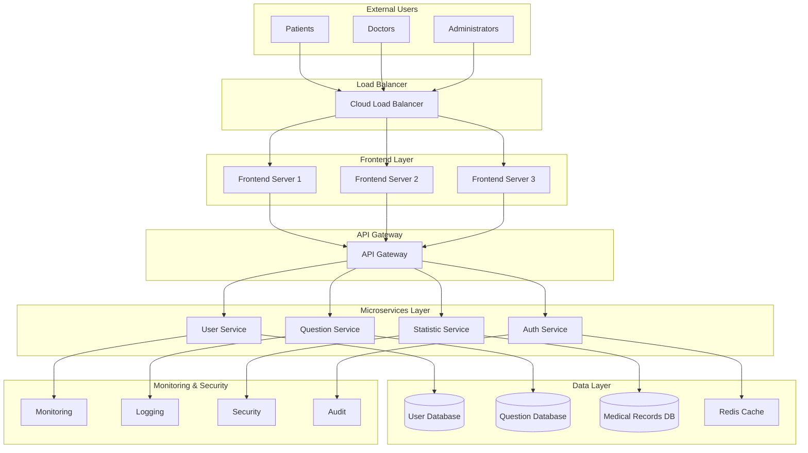
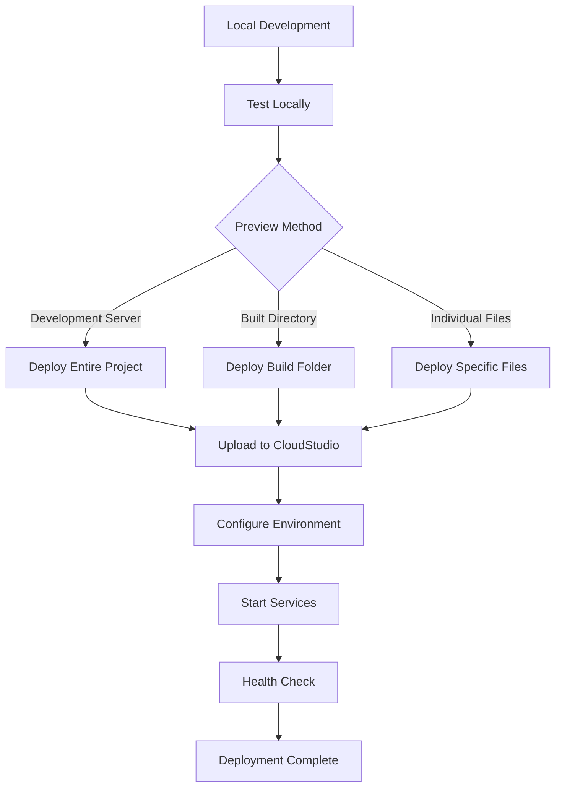

# Deployment Configuration

## Overview
This document describes the deployment configuration and processes for the QA Healthcare workspace. It provides guidance for deploying the healthcare QA system to various environments, with special attention to healthcare data security and compliance requirements.

## Deployment Architecture

### System Architecture Diagram


## Environment Configuration

### Development Environment
```yaml
# Environment: Development
# Purpose: Local development and testing

# Frontend Configuration
FRONTEND_PORT: 5173
FRONTEND_URL: http://localhost:5173
API_BASE_URL: http://localhost:8080
ENABLE_HOT_RELOAD: true
DEBUG_MODE: true

# Backend Services
USER_SERVICE_PORT: 8080
USER_SERVICE_URL: http://localhost:8080
QUESTION_SERVICE_PORT: 8081
QUESTION_SERVICE_URL: http://localhost:8081
STATISTIC_SERVICE_PORT: 8082
STATISTIC_SERVICE_URL: http://localhost:8082

# Database Configuration (Development)
DB_HOST: localhost
DB_PORT: 5432
DB_NAME: qa_healthcare_dev
DB_USER: dev_user
DB_PASSWORD: dev_password
DB_SSL: false

# Security (Relaxed for development)
ENABLE_CORS: true
CORS_ORIGINS: "*"
ENCRYPTION_ENABLED: false
AUDIT_LOGGING: basic
```

### Staging Environment
```yaml
# Environment: Staging
# Purpose: Pre-production testing and validation

# Frontend Configuration
FRONTEND_PORT: 80
FRONTEND_URL: https://staging.qa-healthcare.com
API_BASE_URL: https://api.staging.qa-healthcare.com
ENABLE_HOT_RELOAD: false
DEBUG_MODE: false

# Backend Services
USER_SERVICE_PORT: 8080
USER_SERVICE_URL: https://user.staging.qa-healthcare.com
QUESTION_SERVICE_PORT: 8081
QUESTION_SERVICE_URL: https://question.staging.qa-healthcare.com
STATISTIC_SERVICE_PORT: 8082
STATISTIC_SERVICE_URL: https://statistic.staging.qa-healthcare.com

# Database Configuration (Staging)
DB_HOST: staging-db.qa-healthcare.com
DB_PORT: 5432
DB_NAME: qa_healthcare_staging
DB_USER: staging_user
DB_PASSWORD: ${DB_STAGING_PASSWORD}
DB_SSL: true

# Security (Enhanced for staging)
ENABLE_CORS: true
CORS_ORIGINS: "https://staging.qa-healthcare.com"
ENCRYPTION_ENABLED: true
AUDIT_LOGGING: detailed
DATA_MASKING: enabled
```

### Production Environment
```yaml
# Environment: Production
# Purpose: Live healthcare service

# Frontend Configuration
FRONTEND_PORT: 443
FRONTEND_URL: https://qa-healthcare.com
API_BASE_URL: https://api.qa-healthcare.com
ENABLE_HOT_RELOAD: false
DEBUG_MODE: false
CDN_ENABLED: true

# Backend Services
USER_SERVICE_PORT: 8080
USER_SERVICE_URL: https://user.qa-healthcare.com
QUESTION_SERVICE_PORT: 8081
QUESTION_SERVICE_URL: https://question.qa-healthcare.com
STATISTIC_SERVICE_PORT: 8082
STATISTIC_SERVICE_URL: https://statistic.qa-healthcare.com

# Database Configuration (Production - High Availability)
DB_HOST: production-db-cluster.qa-healthcare.com
DB_PORT: 5432
DB_NAME: qa_healthcare_prod
DB_USER: prod_user
DB_PASSWORD: ${DB_PROD_PASSWORD}
DB_SSL: true
DB_POOL_SIZE: 20
DB_REPLICA_ENABLED: true

# Security (Maximum for healthcare production)
ENABLE_CORS: true
CORS_ORIGINS: "https://qa-healthcare.com"
ENCRYPTION_ENABLED: true
AUDIT_LOGGING: full
DATA_MASKING: enabled
COMPLIANCE_MODE: "hipaa_gdpr"
TLS_VERSION: "1.3"
```

## Deployment Methods

### 1. Local Development Deployment

#### Using npm Scripts (Recommended)
```bash
# Install dependencies
npm install
npm run install:all

# Start all services (frontend + backend)
npm run dev

# Start frontend only
npm run dev:web

# Start backend services only
npm run dev:server

# Start specific backend service
npm run dev:user      # User service on port 8080
npm run dev:question  # Question service on port 8081
```

#### Using Management Scripts
```bash
# Frontend management (web/qa-web/)
./app-management.sh start     # Start frontend
./app-management.sh stop      # Stop frontend
./app-management.sh restart   # Restart frontend
./app-management.sh status    # Check status
./app-management.sh logs      # View logs

# Backend service management (server/qa-service-user/)
./start.sh      # Start user service
./stop.sh       # Stop user service
./restart.sh    # Restart user service
./status.sh     # Check status
```

### 2. CloudStudio Deployment

#### Deployment Workflow


#### CloudStudio Rules
1. **Local Testing First**: Always test locally before deployment
2. **Content Matching**: Deployed files must match preview content
3. **Scope Selection**:
   - Development server preview → Deploy entire project
   - Built directory preview → Deploy build folder (dist/, build/)
   - Individual file preview → Deploy specific files + dependencies
4. **File Consistency**: Include all files loaded in browser preview
5. **Ignore Rules**: Files in `.gitignore` are automatically excluded

#### Deployment Commands
```bash
# For development server preview (recommended)
# Deploy entire project to CloudStudio

# For built project preview
# Build frontend first
cd web/qa-web
npm run build
# Deploy dist/ directory to CloudStudio

# For individual file preview
# Use paths parameter to deploy specific files
```

### 3. Docker Deployment

#### Docker Configuration
```dockerfile
# Frontend Dockerfile
FROM node:18-alpine as build
WORKDIR /app
COPY package*.json ./
RUN npm ci
COPY . .
RUN npm run build

FROM nginx:alpine
COPY --from=build /app/dist /usr/share/nginx/html
COPY nginx.conf /etc/nginx/nginx.conf
EXPOSE 80
CMD ["nginx", "-g", "daemon off;"]

# Backend Dockerfile (example for user service)
FROM openjdk:17-jdk-slim
WORKDIR /app
COPY target/qa-service-user-0.0.1-SNAPSHOT.jar app.jar
EXPOSE 8080
ENTRYPOINT ["java", "-jar", "app.jar"]
```

#### Docker Compose Configuration
```yaml
version: '3.8'

services:
  # Database
  postgres:
    image: postgres:15-alpine
    environment:
      POSTGRES_DB: qa_healthcare
      POSTGRES_USER: healthcare_user
      POSTGRES_PASSWORD: ${DB_PASSWORD}
    volumes:
      - postgres_data:/var/lib/postgresql/data
    ports:
      - "5432:5432"
    healthcheck:
      test: ["CMD-SHELL", "pg_isready -U healthcare_user"]
      interval: 10s
      timeout: 5s
      retries: 5

  # Redis Cache
  redis:
    image: redis:7-alpine
    ports:
      - "6379:6379"
    healthcheck:
      test: ["CMD", "redis-cli", "ping"]
      interval: 10s
      timeout: 5s
      retries: 5

  # User Service
  user-service:
    build: ./server/qa-service-user
    environment:
      SPRING_PROFILES_ACTIVE: docker
      DB_HOST: postgres
      DB_PORT: 5432
      REDIS_HOST: redis
    ports:
      - "8080:8080"
    depends_on:
      postgres:
        condition: service_healthy
      redis:
        condition: service_healthy
    healthcheck:
      test: ["CMD", "curl", "-f", "http://localhost:8080/actuator/health"]
      interval: 30s
      timeout: 10s
      retries: 3

  # Question Service
  question-service:
    build: ./server/qa-service-question
    environment:
      SPRING_PROFILES_ACTIVE: docker
      DB_HOST: postgres
      DB_PORT: 5432
    ports:
      - "8081:8081"
    depends_on:
      postgres:
        condition: service_healthy

  # Frontend
  frontend:
    build: ./web/qa-web
    ports:
      - "5173:80"
    depends_on:
      - user-service
      - question-service

volumes:
  postgres_data:
```

### 4. Kubernetes Deployment

#### Kubernetes Configuration
```yaml
# frontend-deployment.yaml
apiVersion: apps/v1
kind: Deployment
metadata:
  name: qa-healthcare-frontend
  labels:
    app: qa-healthcare
    component: frontend
spec:
  replicas: 3
  selector:
    matchLabels:
      app: qa-healthcare
      component: frontend
  template:
    metadata:
      labels:
        app: qa-healthcare
        component: frontend
    spec:
      containers:
      - name: frontend
        image: qa-healthcare-frontend:latest
        ports:
        - containerPort: 80
        resources:
          requests:
            memory: "256Mi"
            cpu: "250m"
          limits:
            memory: "512Mi"
            cpu: "500m"
        livenessProbe:
          httpGet:
            path: /
            port: 80
          initialDelaySeconds: 30
          periodSeconds: 10
        readinessProbe:
          httpGet:
            path: /
            port: 80
          initialDelaySeconds: 5
          periodSeconds: 5
---
apiVersion: v1
kind: Service
metadata:
  name: qa-healthcare-frontend
spec:
  selector:
    app: qa-healthcare
    component: frontend
  ports:
  - port: 80
    targetPort: 80
  type: LoadBalancer
```

## Healthcare Specific Deployment Considerations

### Data Security Requirements
```yaml
# Healthcare Data Security Configuration
security:
  # Encryption
  data_encryption:
    at_rest: "AES-256"
    in_transit: "TLS 1.3"
    key_management: "HSM or KMS"
  
  # Access Control
  access_control:
    rbac_enabled: true
    abac_enabled: true
    mfa_required: true
    session_timeout: 900 # 15 minutes
  
  # Audit & Compliance
  compliance:
    hipaa: true
    gdpr: true
    audit_logging: "full"
    retention_period: "7 years"
  
  # Data Protection
  data_protection:
    masking_enabled: true
    anonymization_enabled: true
    pseudonymization_enabled: true
    backup_encryption: true
```

### High Availability Configuration
```yaml
# High Availability Setup
high_availability:
  # Database
  database:
    replication: "synchronous"
    failover: "automatic"
    backup:
      frequency: "hourly"
      retention: "30 days"
      encryption: true
  
  # Application
  application:
    load_balancing: "round-robin"
    health_checks: "active"
    auto_scaling:
      enabled: true
      min_replicas: 3
      max_replicas: 10
      cpu_threshold: 70
      memory_threshold: 80
  
  # Disaster Recovery
  disaster_recovery:
    rto: "4 hours"  # Recovery Time Objective
    rpo: "15 minutes" # Recovery Point Objective
    backup_location: "geo-redundant"
```

## Deployment Scripts

### Full Deployment Script
```bash
#!/bin/bash
# deploy.sh - Full deployment script for QA Healthcare

set -e  # Exit on error

echo "🚀 Starting QA Healthcare Deployment"
echo "====================================="

# Configuration
ENVIRONMENT=${1:-"development"}
TIMESTAMP=$(date +%Y%m%d_%H%M%S)
BACKUP_DIR="backups/deployment_${TIMESTAMP}"

# Create backup directory
mkdir -p "$BACKUP_DIR"

# Function to check prerequisites
check_prerequisites() {
    echo "🔍 Checking prerequisites..."
    
    # Check Node.js
    if ! command -v node &> /dev/null; then
        echo "❌ Node.js is not installed"
        exit 1
    fi
    echo "✅ Node.js: $(node --version)"
    
    # Check npm
    if ! command -v npm &> /dev/null; then
        echo "❌ npm is not installed"
        exit 1
    fi
    echo "✅ npm: $(npm --version)"
    
    # Check Java for backend
    if [ "$ENVIRONMENT" != "frontend-only" ]; then
        if ! command -v java &> /dev/null; then
            echo "❌ Java is not installed"
            exit 1
        fi
        echo "✅ Java: $(java --version | head -n 1)"
    fi
    
    echo "✅ All prerequisites satisfied"
}

# Function to deploy frontend
deploy_frontend() {
    echo "🌐 Deploying frontend..."
    
    cd web/qa-web || exit 1
    
    # Backup current build
    if [ -d "dist" ]; then
        echo "📦 Backing up current build..."
        cp -r dist "../${BACKUP_DIR}/frontend_dist"
    fi
    
    # Install dependencies
    echo "📦 Installing dependencies..."
    npm ci --silent
    
    # Build frontend
    echo "🔨 Building frontend..."
    npm run build
    
    # Verify build
    if [ ! -f "dist/index.html" ]; then
        echo "❌ Frontend build failed - index.html not found"
        exit 1
    fi
    
    echo "✅ Frontend deployed successfully"
    cd ../..
}

# Function to deploy backend services
deploy_backend() {
    echo "⚙️ Deploying backend services..."
    
    # Deploy user service
    echo "👤 Deploying user service..."
    cd server/qa-service-user || exit 1
    
    # Backup
    if [ -f "target/qa-service-user-0.0.1-SNAPSHOT.jar" ]; then
        cp target/qa-service-user-0.0.1-SNAPSHOT.jar "../../${BACKUP_DIR}/"
    fi
    
    # Build
    ./mvnw clean package -DskipTests
    
    # Verify
    if [ ! -f "target/qa-service-user-0.0.1-SNAPSHOT.jar" ]; then
        echo "❌ User service build failed"
        exit 1
    fi
    
    echo "✅ User service deployed"
    cd ../..
    
    # Deploy question service
    echo "❓ Deploying question service..."
    cd server/qa-service-question || exit 1
    
    # Build
    ./mvnw clean package -DskipTests
    
    # Verify
    if [ ! -f "target/qa-service-question-0.0.1-SNAPSHOT.jar" ]; then
        echo "❌ Question service build failed"
        exit 1
    fi
    
    echo "✅ Question service deployed"
    cd ../..
}

# Function to start services
start_services() {
    echo "🚦 Starting services..."
    
    # Start backend services in background
    echo "⚙️ Starting backend services..."
    cd server/qa-service-user
    ./start.sh &
    USER_SERVICE_PID=$!
    cd ../..
    
    cd server/qa-service-question
    ./start.sh &
    QUESTION_SERVICE_PID=$!
    cd ../..
    
    # Wait for backend services to start
    echo "⏳ Waiting for backend services..."
    sleep 10
    
    # Check if services are running
    if ! ps -p $USER_SERVICE_PID > /dev/null; then
        echo "❌ User service failed to start"
        exit 1
    fi
    
    if ! ps -p $QUESTION_SERVICE_PID > /dev/null; then
        echo "❌ Question service failed to start"
        exit 1
    fi
    
    # Start frontend
    echo "🌐 Starting frontend..."
    cd web/qa-web
    ./app-management.sh start
    
    echo "✅ All services started successfully"
    
    # Display service information
    echo ""
    echo "📊 Deployment Summary:"
    echo "======================"
    echo "Frontend: http://localhost:5173"
    echo "User Service: http://localhost:8080"
    echo "Question Service: http://localhost:8081"
    echo ""
    echo "Health Checks:"
    echo "Frontend: curl http://localhost:5173"
    echo "User Service: curl http://localhost:8080/actuator/health"
    echo "Question Service: curl http://localhost:8081/actuator/health"
}

# Main deployment process
main() {
    echo "🏥 QA Healthcare Deployment - Environment: $ENVIRONMENT"
    echo "========================================================"
    
    check_prerequisites
    
    case $ENVIRONMENT in
        "development")
            deploy_frontend
            deploy_backend
            start_services
            ;;
        "frontend-only")
            deploy_frontend
            cd web/qa-web
            ./app-management.sh start
            ;;
        "backend-only")
            deploy_backend
            start_services
            ;;
        "build-only")
            deploy_frontend
            deploy_backend
            echo "✅ Build completed. Services not started."
            ;;
        *)
            echo "❌ Unknown environment: $ENVIRONMENT"
            echo "Usage: $0 {development|frontend-only|backend-only|build-only}"
            exit 1
            ;;
    esac
    
    echo ""
    echo "🎉 Deployment completed successfully!"
    echo "Backup saved to: $BACKUP_DIR"
}

# Run main function
main "$@"
```

### Health Check Script
```bash
#!/bin/bash
# health-check.sh - Health check for QA Healthcare services

echo "🏥 QA Healthcare Health Check"
echo "============================="

# Configuration
FRONTEND_URL="http://localhost:5173"
USER_SERVICE_URL="http://localhost:8080/actuator/health"
QUESTION_SERVICE_URL="http://localhost:8081/actuator/health"
TIMEOUT=10

# Function to check HTTP service
check_service() {
    local name=$1
    local url=$2
    
    echo -n "🔍 Checking $name... "
    
    if curl -s -f --max-time $TIMEOUT "$url" > /dev/null; then
        echo "✅ UP"
        return 0
    else
        echo "❌ DOWN"
        return 1
    fi
}

# Function to check process
check_process() {
    local name=$1
    local pid_file=$2
    
    echo -n "🔍 Checking $name process... "
    
    if [ -f "$pid_file" ]; then
        PID=$(cat "$pid_file")
        if ps -p "$PID" > /dev/null 2>&1; then
            echo "✅ RUNNING (PID: $PID)"
            return 0
        else
            echo "❌ STOPPED (stale PID file)"
            rm -f "$pid_file"
            return 1
        fi
    else
        echo "❌ STOPPED (no PID file)"
        return 1
    fi
}

# Perform checks
echo ""
echo "📊 Service Status:"
echo "-----------------"

# Check frontend
check_process "Frontend" "web/qa-web/.pid"

# Check user service
check_process "User Service" "server/qa-service-user/qa-service-user.pid"

# Check question service
check_process "Question Service" "server/qa-service-question/qa-service-question.pid"

echo ""
echo "🌐 HTTP Endpoint Status:"
echo "-----------------------"

# Check HTTP endpoints
check_service "Frontend" "$FRONTEND_URL"
check_service "User Service" "$USER_SERVICE_URL"
check_service "Question Service" "$QUESTION_SERVICE_URL"

echo ""
echo "📈 System Resources:"
echo "-------------------"

# Check system resources
echo -n "💾 Memory usage: "
free -h | awk '/^Mem:/ {print $3 "/" $2}'

echo -n "💿 Disk usage: "
df -h . | awk 'NR==2 {print $3 "/" $2 " (" $5 ")"}'

echo -n "🔥 CPU load: "
uptime | awk -F'load average:' '{print $2}'

echo ""
echo "📋 Summary:"
echo "----------"

# Count successful checks
SUCCESS_COUNT=0
TOTAL_CHECKS=6

if check_service "Frontend" "$FRONTEND_URL" > /dev/null; then
    ((SUCCESS_COUNT++))
fi

if check_service "User Service" "$USER_SERVICE_URL" > /dev/null; then
    ((SUCCESS_COUNT++))
fi

if check_service "Question Service" "$QUESTION_SERVICE_URL" > /dev/null; then
    ((SUCCESS_COUNT++))
fi

if check_process "Frontend" "web/qa-web/.pid" > /dev/null; then
    ((SUCCESS_COUNT++))
fi

if check_process "User Service" "server/qa-service-user/qa-service-user.pid" > /dev/null; then
    ((SUCCESS_COUNT++))
fi

if check_process "Question Service" "server/qa-service-question/qa-service-question.pid" > /dev/null; then
    ((SUCCESS_COUNT++))
fi

HEALTH_PERCENTAGE=$((SUCCESS_COUNT * 100 / TOTAL_CHECKS))

echo ""
if [ $HEALTH_PERCENTAGE -eq 100 ]; then
    echo "🎉 System Health: EXCELLENT ($HEALTH_PERCENTAGE%)"
elif [ $HEALTH_PERCENTAGE -ge 80 ]; then
    echo "👍 System Health: GOOD ($HEALTH_PERCENTAGE%)"
elif [ $HEALTH_PERCENTAGE -ge 60 ]; then
    echo "⚠️  System Health: FAIR ($HEALTH_PERCENTAGE%)"
else
    echo "❌ System Health: POOR ($HEALTH_PERCENTAGE%)"
    echo "   Some services may need attention."
fi

exit 0
```

## Monitoring and Maintenance

### Monitoring Configuration
```yaml
# monitoring-config.yaml
monitoring:
  # Application Metrics
  metrics:
    collection_interval: "30s"
    retention_period: "30d"
    exporters: ["prometheus", "datadog"]
  
  # Logging
  logging:
    level: "INFO"
    format: "json"
    retention: "90d"
    aggregation: "loki"
  
  # Alerting
  alerting:
    enabled: true
    channels: ["email", "slack", "pagerduty"]
    thresholds:
      cpu_usage: 80
      memory_usage: 85
      disk_usage: 90
      error_rate: 5
      response_time: "2000ms"
  
  # Health Checks
  health_checks:
    frequency: "60s"
    endpoints:
      - name: "frontend"
        url: "https://qa-healthcare.com/health"
      - name: "user-service"
        url: "https://user.qa-healthcare.com/actuator/health"
      - name: "question-service"
        url: "https://question.qa-healthcare.com/actuator/health"
```

### Backup and Recovery
```bash
#!/bin/bash
# backup.sh - Backup script for QA Healthcare

# Configuration
BACKUP_DIR="/backups/qa-healthcare"
TIMESTAMP=$(date +%Y%m%d_%H%M%S)
RETENTION_DAYS=30

# Create backup directory
mkdir -p "$BACKUP_DIR/$TIMESTAMP"

echo "💾 Starting QA Healthcare Backup"
echo "================================"

# 1. Database Backup
echo "🗄️  Backing up databases..."
pg_dump -h $DB_HOST -U $DB_USER -d qa_healthcare_prod \
  -F c -f "$BACKUP_DIR/$TIMESTAMP/database.backup"

# 2. Configuration Backup
echo "⚙️  Backing up configurations..."
cp -r /etc/qa-healthcare "$BACKUP_DIR/$TIMESTAMP/config"

# 3. Log Backup
echo "📝 Backing up logs..."
tar -czf "$BACKUP_DIR/$TIMESTAMP/logs.tar.gz" /var/log/qa-healthcare

# 4. Application Backup
echo "📦 Backing up applications..."
docker commit user-service "$BACKUP_DIR/$TIMESTAMP/user-service-image"
docker commit question-service "$BACKUP_DIR/$TIMESTAMP/question-service-image"

# 5. Encrypt sensitive backups
echo "🔐 Encrypting sensitive data..."
gpg --encrypt --recipient "backup@qa-healthcare.com" \
  "$BACKUP_DIR/$TIMESTAMP/database.backup"

# 6. Clean up old backups
echo "🧹 Cleaning up old backups..."
find "$BACKUP_DIR" -type d -mtime +$RETENTION_DAYS -exec rm -rf {} \;

echo "✅ Backup completed: $BACKUP_DIR/$TIMESTAMP"
```

## Troubleshooting

### Common Issues and Solutions

#### Issue 1: Port Conflicts
```bash
# Check port usage
sudo lsof -i :8080  # User service port
sudo lsof -i :8081  # Question service port
sudo lsof -i :5173  # Frontend port

# Kill process using port
sudo kill -9 $(sudo lsof -t -i:8080)
```

#### Issue 2: Database Connection Problems
```bash
# Test database connection
psql -h $DB_HOST -p $DB_PORT -U $DB_USER -d $DB_NAME -c "SELECT 1;"

# Check database status
sudo systemctl status postgresql

# View database logs
sudo tail -f /var/log/postgresql/postgresql-15-main.log
```

#### Issue 3: Service Startup Failures
```bash
# Check service logs
tail -f server/qa-service-user/logs/application.log
tail -f web/qa-web/logs/application.log

# Check Java version
java -version

# Check Maven build
cd server/qa-service-user
./mvnw clean compile
```

#### Issue 4: Memory Issues
```bash
# Check memory usage
free -h
top -o %MEM

# Increase Java heap size (in start.sh)
java -Xmx1024m -Xms512m -jar target/qa-service-user-0.0.1-SNAPSHOT.jar
```

### Healthcare Specific Troubleshooting

#### Medical Data Access Issues
```bash
# Check audit logs for access violations
sudo grep "ACCESS_DENIED" /var/log/qa-healthcare/audit.log

# Verify encryption status
openssl version
java -version | grep "TLS"

# Check compliance configuration
cat /etc/qa-healthcare/compliance/hipaa_config.json
```

#### Performance Optimization
```bash
# Monitor database performance
pg_stat_activity
pg_stat_statements

# Check API response times
curl -w "\nTime: %{time_total}s\n" https://api.qa-healthcare.com/health

# Analyze slow queries
EXPLAIN ANALYZE SELECT * FROM medical_records WHERE patient_id = 'patient001';
```

---

*This deployment documentation should be updated whenever the deployment process or infrastructure changes. For healthcare systems, always prioritize data security, compliance, and high availability in deployment decisions.*