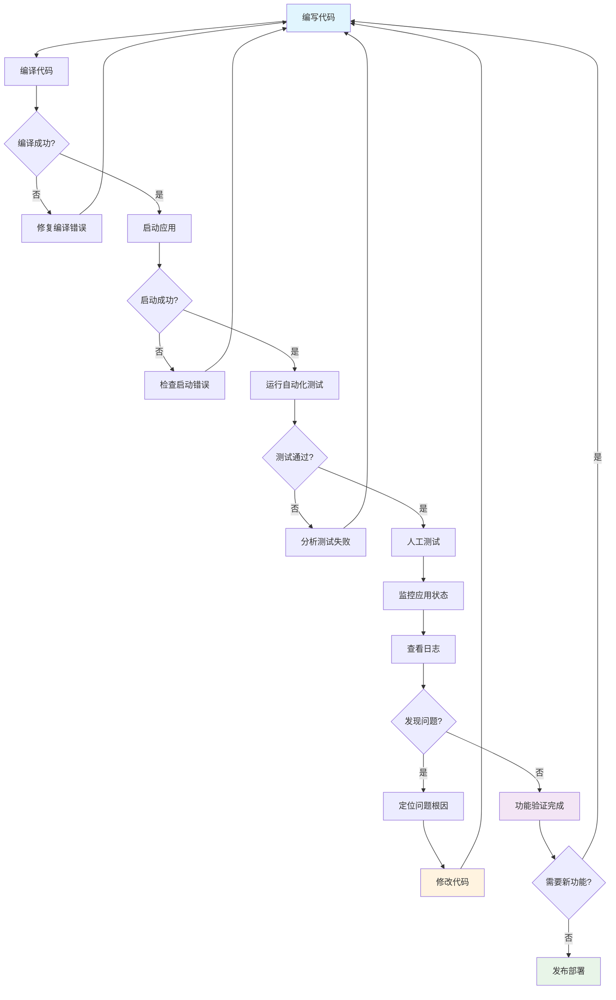

# 软件开发调试循环

## 调试过程流程图

## 调试循环说明

### 1. 开发阶段
- **编写代码**: 实现新功能或修复问题
- **编译代码**: 检查语法错误和类型错误
- **修复编译错误**: 解决编译时发现的问题

### 2. 测试阶段
- **启动应用**: 验证应用能否正常启动
- **运行自动化测试**: 执行单元测试、集成测试
- **人工测试**: 手动验证功能是否符合预期

### 3. 监控阶段
- **监控应用状态**: 观察应用运行状态
- **查看日志**: 分析应用日志，寻找异常信息
- **发现问题**: 识别潜在的 bug 或性能问题

### 4. 修复阶段
- **定位问题根因**: 深入分析问题原因
- **修改代码**: 实施修复方案
- **重新进入循环**: 回到编写代码阶段

### 5. 完成阶段
- **功能验证完成**: 确认所有功能正常
- **发布部署**: 将代码部署到生产环境

## 关键要点

1. **持续循环**: 调试是一个持续的循环过程，直到所有问题都被解决
2. **早期发现**: 在开发过程中尽早发现和修复问题
3. **自动化测试**: 利用自动化测试提高效率和覆盖率
4. **日志监控**: 通过日志和监控及时发现运行时问题
5. **根因分析**: 深入分析问题根本原因，避免类似问题重复出现

## 最佳实践

- 在每个阶段都要仔细检查，避免问题传递到下一阶段
- 建立完善的测试用例，覆盖各种场景
- 使用版本控制系统，便于回滚和问题追踪
- 建立良好的日志记录机制，便于问题定位
- 定期进行代码审查，提前发现潜在问题