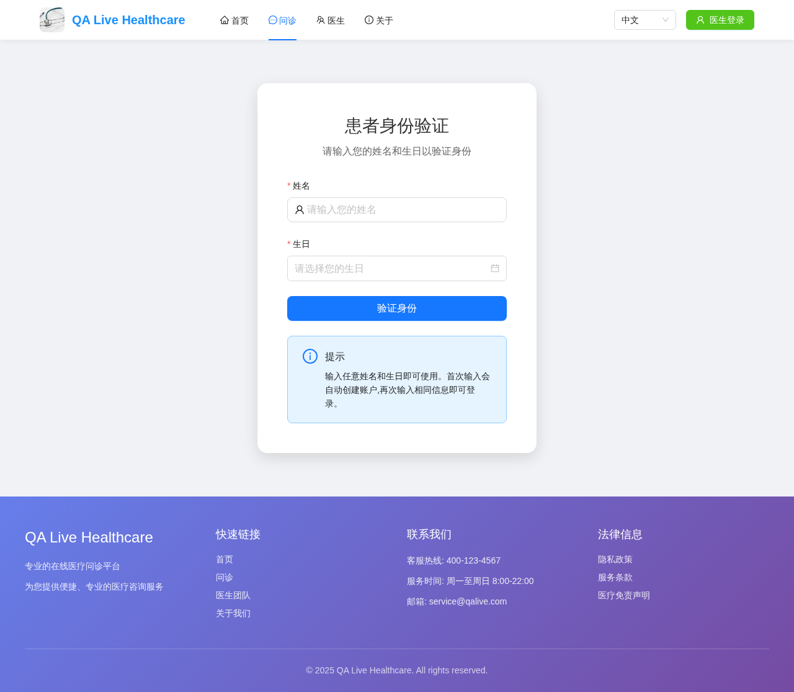
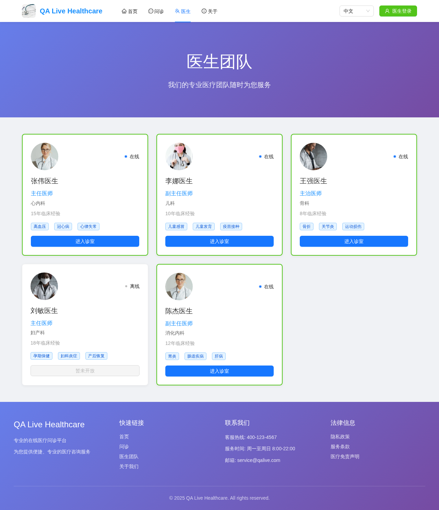
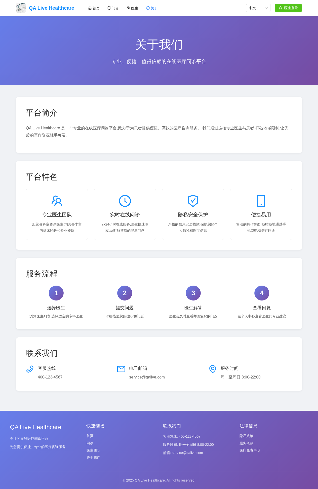
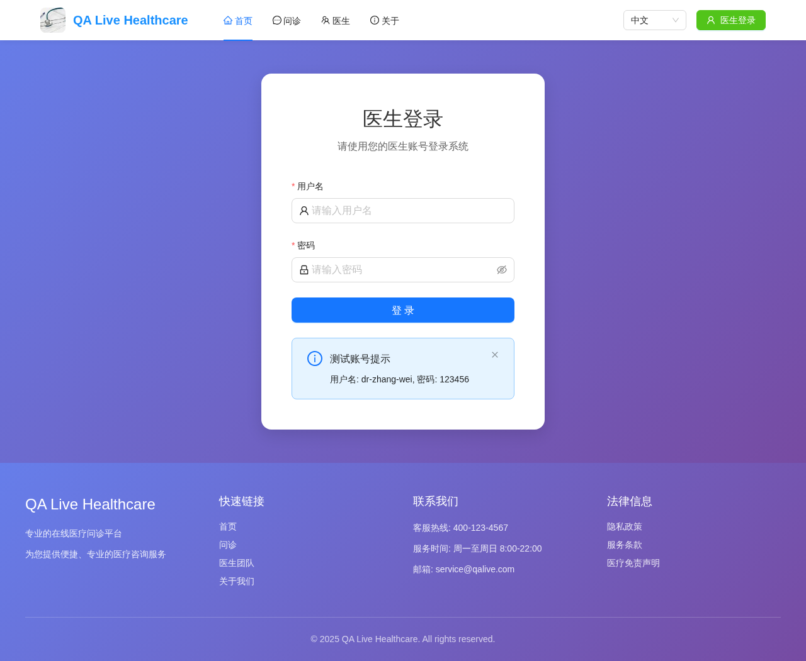
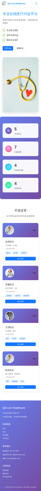
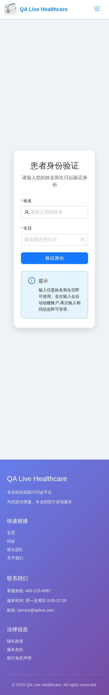
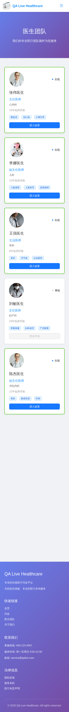
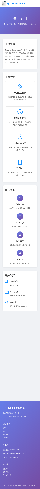
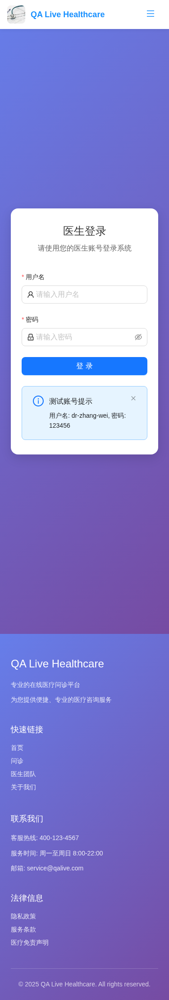

# 002-所有页面响应式测试报告

## 测试概述

本测试验证 QA 医疗问答系统前端应用的所有页面在桌面和手机端的响应式加载情况，确保用户在不同设备上都能获得良好的使用体验。

### 测试环境

- **测试时间**: 2025-11-16 21:56:40 (GMT+8)
- **前端地址**: http://localhost:5173
- **测试设备**: 桌面端 (1280x800) 和 手机端 (375x667)
- **测试工具**: Playwright

### 测试范围

本测试涵盖以下页面：
- **首页** (`/`): 应用主页
- **咨询页面** (`/consultation`): 通用咨询页面
- **医生列表** (`/doctors`): 医生列表页面
- **关于页面** (`/about`): 关于我们页面
- **医生登录** (`/doctor/login`): 医生登录页面

## 测试结果统计

### 总体统计

- **总测试数**: 10 项
- **成功测试**: 10 项
- **失败测试**: 0 项
- **成功率**: 100%

- **桌面端**: 5/5 (100%)
- **手机端**: 5/5 (100%)

### 按页面统计

| 页面 | 桌面端 | 手机端 | 总体 |
|------|--------|--------|------|
| 首页 | ✅ | ✅ | ✅ |
| 咨询页面 | ✅ | ✅ | ✅ |
| 医生列表 | ✅ | ✅ | ✅ |
| 关于页面 | ✅ | ✅ | ✅ |
| 医生登录 | ✅ | ✅ | ✅ |

## 详细测试结果

### 桌面端 测试结果

#### 首页 (/)

- **状态**: ✅ 成功
- **加载时间**: 660ms
- **截图**: [📸 桌面端_首页.png](./assets/桌面端_首页.png)

#### 咨询页面 (/consultation)

- **状态**: ✅ 成功
- **加载时间**: 720ms
- **截图**: [📸 桌面端_咨询页面.png](./assets/桌面端_咨询页面.png)

#### 医生列表 (/doctors)

- **状态**: ✅ 成功
- **加载时间**: 711ms
- **截图**: [📸 桌面端_医生列表.png](./assets/桌面端_医生列表.png)

#### 关于页面 (/about)

- **状态**: ✅ 成功
- **加载时间**: 636ms
- **截图**: [📸 桌面端_关于页面.png](./assets/桌面端_关于页面.png)

#### 医生登录 (/doctor/login)

- **状态**: ✅ 成功
- **加载时间**: 674ms
- **截图**: [📸 桌面端_医生登录.png](./assets/桌面端_医生登录.png)

### 手机端 测试结果

#### 首页 (/)

- **状态**: ✅ 成功
- **加载时间**: 3437ms
- **截图**: [📸 手机端_首页.png](./assets/手机端_首页.png)

#### 咨询页面 (/consultation)

- **状态**: ✅ 成功
- **加载时间**: 3434ms
- **截图**: [📸 手机端_咨询页面.png](./assets/手机端_咨询页面.png)

#### 医生列表 (/doctors)

- **状态**: ✅ 成功
- **加载时间**: 3390ms
- **截图**: [📸 手机端_医生列表.png](./assets/手机端_医生列表.png)

#### 关于页面 (/about)

- **状态**: ✅ 成功
- **加载时间**: 3283ms
- **截图**: [📸 手机端_关于页面.png](./assets/手机端_关于页面.png)

#### 医生登录 (/doctor/login)

- **状态**: ✅ 成功
- **加载时间**: 3351ms
- **截图**: [📸 手机端_医生登录.png](./assets/手机端_医生登录.png)

## 测试结论与建议

### 🎉 测试结论

所有页面在桌面和手机端都能正常加载，响应式设计工作良好。系统在不同设备上都能提供良好的用户体验。

### 🚀 改进建议

1. **响应式优化**: 针对加载失败的页面，检查响应式CSS和JavaScript适配
2. **性能优化**: 优化页面加载时间，特别是移动端的加载体验
3. **兼容性测试**: 定期进行跨浏览器和跨设备测试
4. **自动化集成**: 将响应式测试集成到CI/CD流程中
5. **用户反馈**: 收集不同设备用户的使用反馈，持续改进体验

---
**测试时间**: 2025-11-16 21:56:40 (GMT+8)
**测试工具**: Playwright
**报告生成**: 自动化测试脚本
